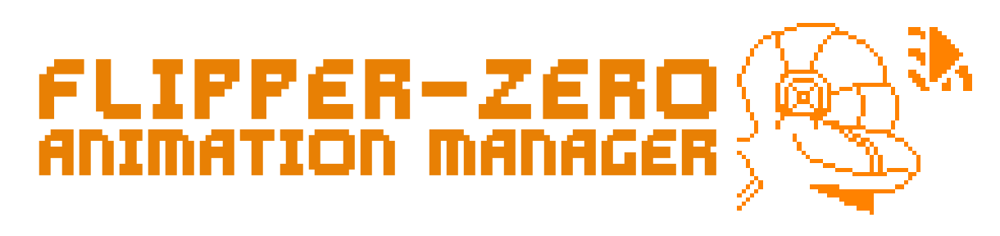
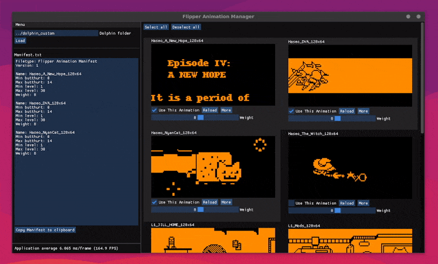

<hr>



<hr>

<h3 align="center">
  Visualize and manage your <a href="https://flipperzero.one">Flipper Zero</a> animations directly from your computer.
</h3>

<p align="center">
    
    
    <a href="https://twitter.com/intent/follow?screen_name=Ooggle_" title="Follow"></a>
</p>

<hr>

<p align="center">
    Preview<br><br>
    
</p>

<br>

# Installation

<h2><a href="https://github.com/Ooggle/FlipperAnimationManager/wiki/Installation-Guide">Detailed Installation Guide here<a></h2>

### Builds are available for Windows, Linux and Mac OS. Download the latest version for your distribution from <a href="https://github.com/Ooggle/FlipperAnimationManager/releases">the Releases.</a>

<br>

# Usage

Detailed guide coming soon...

<br>

# Build from sources

## Linux and Mac OS

Install dependencies:   
```bash
# On Linux
sudo apt install libsdl2-dev g++ make

# On Mac OS (be sure to have g++ and make installed, via XCode for example)
brew install sdl2
```

Clone the repository:   
```bash
git clone https://github.com/Ooggle/FlipperAnimationManager.git && cd FlipperAnimationManager
```

Building the project:   
```bash
make
```

The binary will be located in `build` folder.

<br>

## Windows

## Via Visual Studio

Clone the project or download a zipped copy of it.

Download the SDL2 library from [the releases](https://github.com/libsdl-org/SDL/releases) (the sdl2-devel-2.xx.x-vc.zip archive) and extract it somewhere in the computer.

Open the `FlipperAM.sln` file with Visual Studio.

Then, go to project settings and replace any %SDL2_DIR% you find in the compiler and linker section by the path of the SDL2 directory previously downloaded. An alternative method is to directly open the FlipperAM.vcxproj file and replace by hand every %SDL2_DIR% by the path of the SDL2 directory.   
⚠️ If it's not done correclty, the build won't work.

Select the Release configuration and build the project, the output binary will be located in `Release` folder.

<br>

Note: You will have to get a copy of `SDL2.dll` from the <a href="https://github.com/libsdl-org/SDL/releases">SDL repository</a> (it's in the SDL2-2.x.x-win32-x64.zip archive) and have it alongside the .exe in order to run the application. 

<br>

## Via MSYS2/MINGW

Install the following dependencies via the command line tool:   
```bash
pacman -S mingw-w64-i686-SDL2
```

Clone the repository:   
```bash
git clone https://github.com/Ooggle/FlipperAnimationManager.git && cd FlipperAnimationManager
```

Building the project:   
```bash
make
```

The binary will be located in `build` folder.

<br>

# Contributing

Pull requests are welcome. Feel free to open an issue if you want to request/discuss other features.

<br>

## Stargazers over time

[](https://starchart.cc/Ooggle/FlipperAnimationManager)

